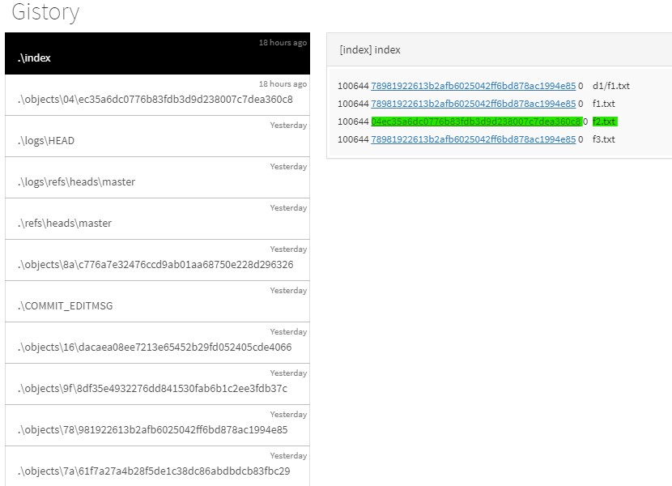
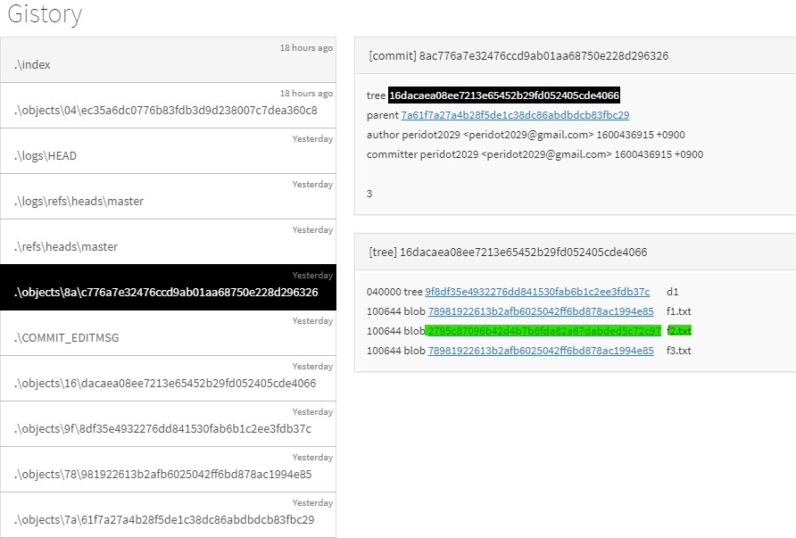
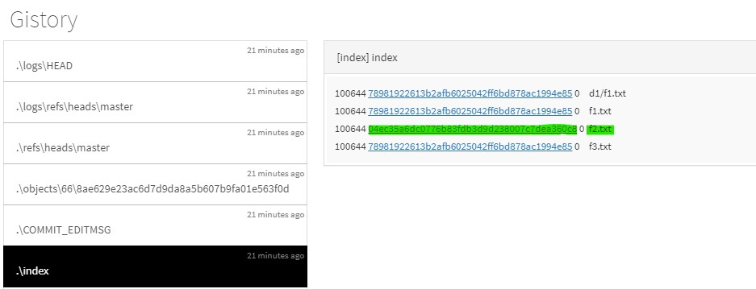
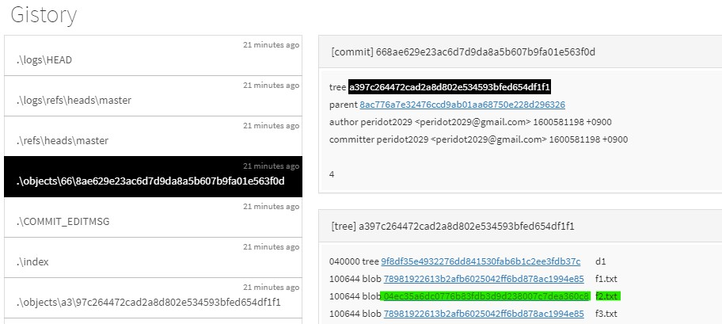

# 📄 Gistory - git status

## 1. Gitstory - git status

### \(1\). git status의 원리

🔎 **Git**이 **index** 파일에서 `git status`를 명령을 하면 어떻게 동작하는 지 정리

* **Git  index**의 파일과 **최신 커밋**의 차이를 비교를 통해서 커밋 할 게  있는 지, 없는 지 여부를 알 수 있다.
  *  **최신 커밋의** **tree**를 클릭해서 확인하면 **tree**에 정보가 출력된다.  
  * 만약 **index**의 내용과 최신 커밋의 **tree**의 내용이 일치한다면 커밋할게 없다고 판단한다.

🔎 **gitfth2** 폴더에서 **f2.txt** 파일 내용 변경 후 → `git status`를 통해서 현재 상태가 수정된 것을 확인

* **Git**은 **index**에서 가리키고 있는 **f2.txt 파일 값과 실제 f2.txt 파일 값**이 다르면 해당 파일이 수정되었다고 감지한다.
* 변경된 **f2.txt** 파일은 `git add`하고, `git status` 명령을 통해서 확인하면 **changes to be committed** 커밋 대상에 포함된 것을 확인한다.
  * **index - f2.txt, 수정한 f2.txt 파일 내용의 값**이 같으므로 파일이 **커밋 대기 상태**임을 알 수 있다.

```bash
# 현재 상태 조회를 하면 commit 할 게 없다고 나온다.
$ git status
On branch master
nothing to commit, working tree clean

# f2.txt 파일 내용을 변경
$ vi f2.txt

$ cat f2.txt
x
y
z

# f2.txt 파일 내용 변경 후 → git status으로 파일이 수정된 것을 확인
# "changes not staged for commit" - 수정만 하고, 커밋에 대상에 포함하지 않는다.
$ git status
On branch master
Changes not staged for commit:
  (use "git add <file>..." to update what will be committed)
  (use "git restore <file>..." to discard changes in working directory)
        modified:   f2.txt

no changes added to commit (use "git add" and/or "git commit -a")


# 변경된 f2.txt 파일 git add
$ git add f2.txt

# f2.txt 파일 git add → git status으로 index 파일 내용과 현재 파일 내용이 일치한다.
# "changes to be committed" - 커밋에 대상, 커밋 대기 상
$ git status
On branch master
Changes to be committed:
  (use "git restore --staged <file>..." to unstage)
        modified:   f2.txt

# commit 대기 상태였던 f2.txt 파일 커밋                
$ git commit -m"4"
[master 668ae62] 4
 1 file changed, 1 insertion(+)
 
# f2.txt 파일은 커밋을 했으므로 더 이상 커밋할게 나온다. 
$ git status
On branch master
nothing to commit, working tree clean
```

🔎 **f2.txt** 파일 내용을 변경 후 `git add`를 실행 →  **index - f2.txt** , **최신 커밋의 tree - f2.txt** 

* **Git**은 **index** 에서 가리키고 있는 **f2.txt 파일의 내용의 값** → `04ec35~c8`
* **최신 커밋의 tree**가 가리키고 있는 **f2.txt 파일의 내용의 값** → `2795c8~97`
* **index - f2.txt**, **최신 커밋의 tree - f2.txt** 파일의 내용의 값이 다르다는 걸 확인하면,  현재 **f2.txt** 파일은 **index**에 `add` 되어서 **커밋 대기 상태**인 걸 확인 할 수 있다.





🔎 커밋 대상인 **f2.txt** 파일을 ****`git commit`를 실행 →  **index -f2.txt,** **최신 커밋의 tree - f2.txt**

🤚**index, staging area, cache** 3가지의 단어는 모두 같은 의미이다.

* `git commit`를 하게 되면 **index**에서 가리키고 있는 **f2.txt** 파일의 내용 값과 그리고 **현재 커밋한 tree의 f2.txt** 파일 내용의 값이 아까와 다르게 일치하는 걸 확인 할 수 있다.
* 즉, **Local repository, Index, Working directory** 3가지 영역이 일치하므로, 정확하게 일치하므로 Git은  **nothing to commit, working tree clean**  더 이상 커밋 할 게 없다고 감지한다.







