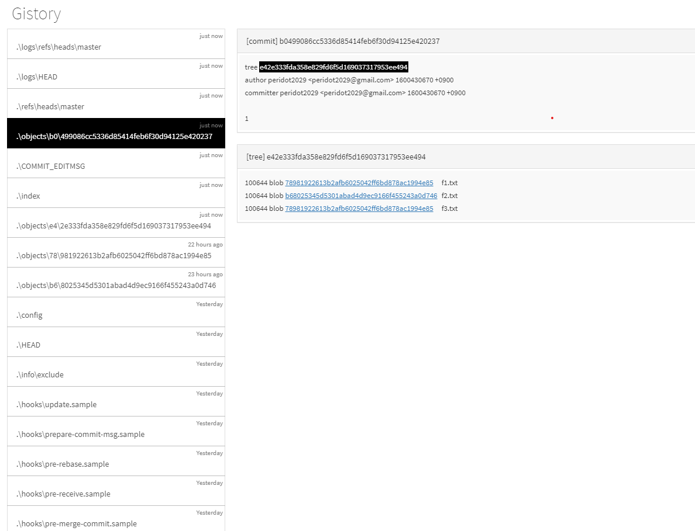
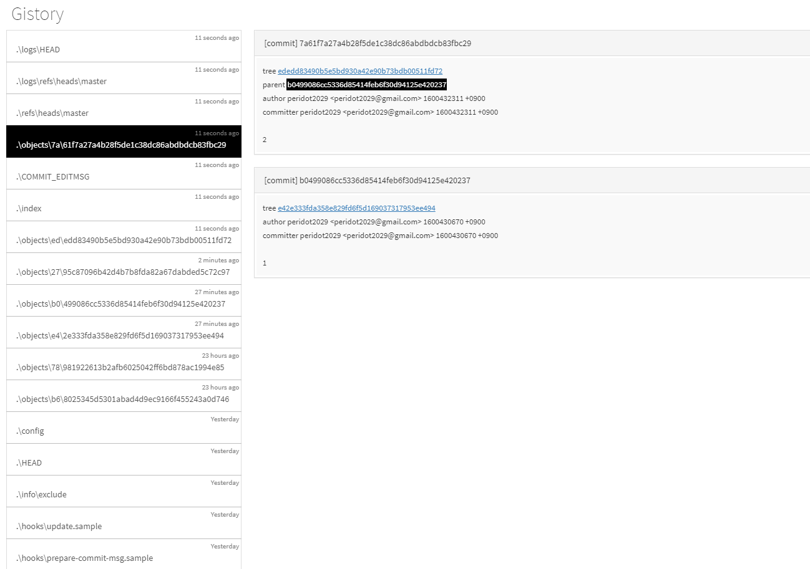
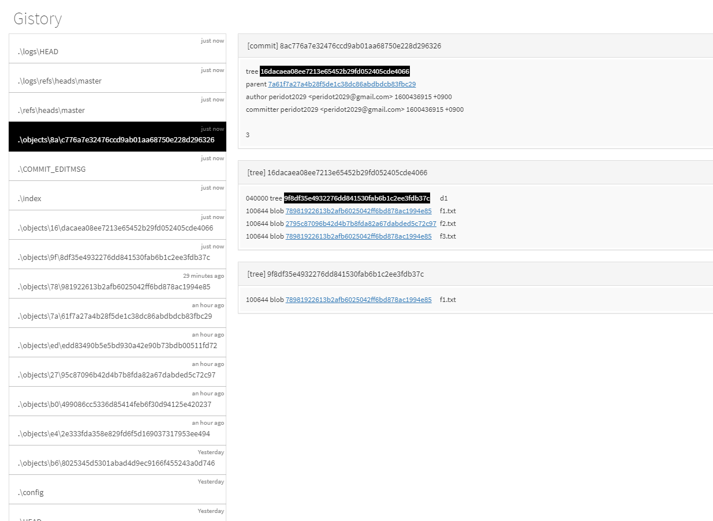

# 📄 Gistory - objects filename, commit

## 1. Gitstory - objects filename, commit 

### \(1\).  objects 파일명의 원리

objects 파일명의 원리는 내용을 기반으로 파일 이름이 결정되는 [**메커니즘 \(mechanism\)**](https://ko.wikipedia.org/wiki/%EB%A9%94%EC%BB%A4%EB%8B%88%EC%A6%98)이 무엇을 사용하는지에 대한 정리

* google 에서 [**sha1 oneline** ](http://www.sha1-online.com/)검색해서 이동한다.
* `hi` 라는 내용을 쳐서 **hash** 버튼을 누르게 되면 밑에 입력된 어떠한 숫자들이 나오는데 , 그 원리는 입력된 문자는 **hash** 라는 메커니즘을 통과하면 **어떤 숫자들이 생성**된다.
* 즉, **Git**은 **sha1** 이라는 **hash** 알고리즘을 통과해서 그 파일의 이름을 도출한 다음\(임의의 hash 값들\), 앞의 **두 글자를 따서 디렉토리**를 만들고, **나머지 hash 코드에 해당하는 파일에 저장** 되게 한다.

### \(2\).  git commit의 원리

[Gistory - Introduction, git add](https://app.gitbook.com/@peridot2029/s/til/~/drafts/-MHVQf9-8KYC2UpVXy4t/git/git-branch) 글에서   `git add`까지 했었다. 

이제 `git commit`을 하고, 커밋 메세지를 작성 후 **gistory** 에 흐름을 확인. 

```bash
# git status를 하면 생성한 f1.txt, f2.txt, f3.txt 파일 나온다.
$ git status
On branch master

No commits yet

Changes to be committed:
  (use "git rm --cached <file>..." to unstage)
        new file:   f1.txt
        new file:   f2.txt
        new file:   f3.txt
        
# add한 f1.txt, f2,txt, f3.txt 파일 commit 
$ git commit -m"1"
[master (root-commit) b049908] 1
 3 files changed, 3 insertions(+)
 create mode 100644 f1.txt
 create mode 100644 f2.txt
 create mode 100644 f3.txt

# log 조회
$ git log --oneline
b049908 (HEAD -> master) 1
```

* `git commit`를 하게되면 그 커밋에 대한 정보 및 버전은 **objects** 로 저장이 된다.
* 생성된 **./objects** 에는 **커밋에 대한 정보,  tree**가 있다. 
* **tree**는 **현재 커밋한 파일명**과 **그 파일들에 대한 링크**가 있다.
* 🤚 **commit**도 **내부적으로 객체**이다. 



*  **f2.txt** 파일 내용을 바꾼 후,`git add` 하고, **gistory**를 확인하면 **./index** 파일에 .**/object** 에서 변경된 **f2.txt** 내용이 확인 가능하다.
* `git commit`한 후에 **gistory**를 확인해보면 **커밋이 담겨 있는 객체 생성된 것을 확인** 할 수 있다.
* 위에서 사진을 보면 아까와 없던 `parent`가 생성되고, 누르면 **해당 커밋의 이전 내용을 확인** 할 수 있다.
* **tree**는 2개의 내용이 존재한다. **현재와 이전 커밋의 tree 값**이 서로 다르다.
  * 각각의 버전마다 **서로 다른 tree** 가리킨다. 해당 **tree**에는 파일의 이름과 내용이 각각 링크 되어있다.
* 커밋에 대한 2가지 중요한 정보
  * **parent**
    *  이전 커밋이 누구인지, **parent** 값이 존재한다.
  * **tree** 
    * 그 커밋이 일어난 시점에 작업 디렉토리 파일의 이름과 이름이 담고 있는 내용 사이의 정보가 **tree**에 담긴다.

```bash
# f2.txt 파일 내용 변경
$ vi f2.txt

# 변경된 f2.txt 파일 확인
$ cat f2.txt
y
z

# 변경 f2.txt 파일 git add
$ git add f2.txt

# add한 f2.txt 파일 git commit
$ git commit -m"2"
[master 7a61f7a] 2
 1 file changed, 1 insertion(+)

# log 확인
$ git log --oneline
7a61f7a (HEAD -> master) 2
b049908 1
```



* 커밋에는 두 가지 중요한 정보가 있다.

  * 이전 커밋이 누구인지\(**parent** 값이 존재\)
  * 그 커밋이 일어난 시점에 작업이 디렉토리 파일의 이름과 이름이 담고 있는 내용 사이의 정보가 **tree**에 담긴다.

* 현재 디렉토리에서 새로운 폴더를 만들고, 현재 디렉토리에 있는 파일 복사한다.
* 그런 다음에 새로운 폴더에 있는 파일을 `git add` 를 한 다음에 **gistory**를 확인하면 **./index** 안에 **d1/f1.txt 가** 생성된 것을 확인 할 수 있다.
* `git commit`를 하고, **gistory**를 확인하면 **parent** 정보가 확인 가능하다.
* 각 **parent**에는 **tree**를 갖고 있어서 해당 시점의 정보가 담겨 있는 걸 확인 할 수 있다.

```bash
# 현재 디렉토리에 d1 폴더 생성
$ mkdir d1

# d1 폴더에 현재 디렉토리에 있는 f1.txt 파일을 복사
$ cp f1.txt d1/f1.txt

# 상태 조회
$ git status
On branch master
Untracked files:
  (use "git add <file>..." to include in what will be committed)
        d1/

# d1 디렉토리에 있는 f1.txt 파일 add
$ git add d1/f1.txt

$ git commit -m"3"
```



### \(3\). objects 파일 영역

 **objects** 파일은 크게 3가지로 나뉜다.

* **blob** 
  * 파일의 내용 가지고 있다.
* **tree** 
  *  파일명, 그 파일명에 내용 해당하는 **blob** 정보를 담고 있다.
*  **commit** 
  *  object id를 가지고 있다.


