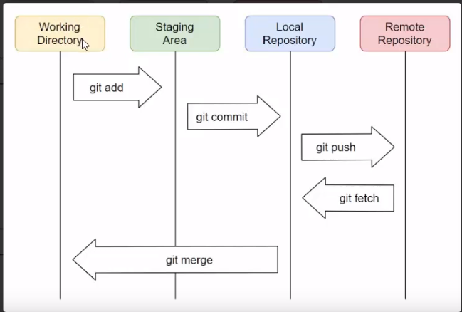

# 📄 Introduction

### 1. Git 

Git은 **버전관리를 위한 프로그램 \(Version Control System\)** 이다.

### 2. Git  영역 및 파일 상태

Git를 사용하기 위해서는 어떻게 구성되어있는지 영역에 대해서 이해를 해야 한다.

#### 1\) Working  directory

현재 작업 하고 있는 공간을 의미한다. Git이 관리하고 있지만 아직 **추적 \(track\)** 하고 있지 않는 상태이다.

#### 2\) Index

**stage** 또는 **staging area** 라고 하며,  준비 공간 의미한다. Git이 추적하고 있으며, 버전으로 등록 되기 전 상태이다.

#### 3\) R**epository**

* **Local repository** 
  * 저장소를 의미 한다.  내 PC에 존재하는 저장소 
* **Remote repository** 
  * **Github, Gitlab** 같은 원격 저장소 

#### **4\) Git이 관리하는 파일들에 대한 상태**

*  **Committed**
  * 데이터가 안전하게 커밋 되었다는 상태
*  **Modified**
  * 수정한 파일을 아직 커밋 하지 않은 상태 
*  **Staged**
  * 재 수정한 파일을 곧 커밋할 것이라는 표시한 상태

### 3. Git Flow

Git에 대한 영역에 대해서 이해를 했다면,  그 다음으로는 Git에 대한 **흐름\(flow\)**에 대해서 알아야 한다. 그래야 Git에 대한 어떠한 명령어를 했을 때 어떤 동작을 할지 상상할 수 있다. 

#### 1\) git init

**.git** 폴더를 생성한다. **.git** 폴더가 있어야 파일을 추적할 수 있으며, **Git**과 관련된 작업을 할 수 있다.

#### 2\) git add

**working directory**의 변경된 작업 파일을 **staging area**로 추가 시킨다.

#### 3\) git commit

**staing area**의 내용을  **local**  **repository**에 확정 짓는다.

#### 4\) git push

**local**  **repository**의 내용을 **remote**  **repository**로 업로드 한다.

#### 5\) git pull

**local**  **repository**의 내용을 **remote**  **repository** 에서  가져온다.

#### 6\) git clone

* **.git** 을 포함한 **remote**  **repository**의 파일들을 **local**  **repository**에 복사한다. 
* 깃헙에서 **zip** 파일로 받으면, .**git** 폴더가 없다는 것이 명령와의 차점 이다.

### 4. Git branch, Git merge

* 여러 개발자들이 동시에 다양한 작업할 수 있게 만들어주는 기능이 바로 **브랜치\(branch\)**이다.  
* 즉, 협업을 하기 위해서는 프로젝트에서 파트별로 브랜치로 나눠서 작업 한 다음에 병합을 해줘야 한다.

#### 1\) git branch

* 독립된  **working directory**를 의미한다.
*  브랜치를 통해 프로젝트 참여자 마다 브랜치를 가져가서 독립된 작업 공간을 갖는다.
*  테스트 및 백업 등의 용도로 사용할 수 있다.

#### 2\) head

포인터를 의미한다. 지금 작업하고 있는 브랜치를 가리킨다.

#### 3\) merge

* 2개의 브랜치에서 작업 다른 내용을 하나로 합치는 것을 말하며, 현재 브랜치를 기준으로 병합한다.
*  만약 두 브랜치가 파일의 같은 곳을 수정해서 **충돌 \(merge conflict\)이** 발생해서 이를 해결해야 한다. 
  *  해당 이슈는 관계자들이 상의하여 수동으로 충돌을 해결해줘야 한다. 
  *  따라서 충돌 이슈가 발생하지 않으려면 작업 내용이 겹치지 않도록 분리시키는게 좋다.

