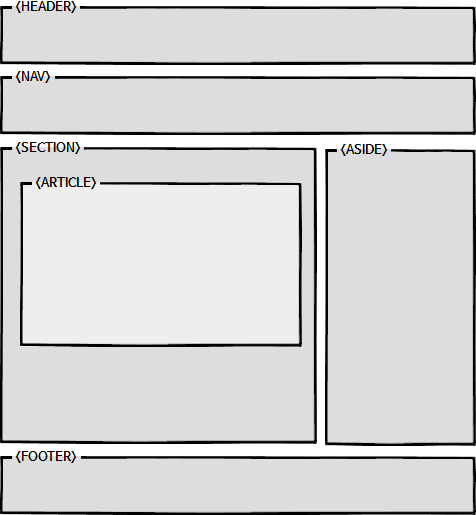

# 📄 HTML Section, Matin Element

## 

## 1. Root Setion Element 정의

`<body>` 문서 안에서 단 한 번만 사용 가능하다.

## 2.  `<section>` Element 정의

섹션 요소는 일반적인 컨테이너 요소가 아니므로, 문서 개요에 명시적으로 나열되는 경우에만 섹션 요소가 적합다는 규칙이 있다.

### \(1\). `<section>` Elemenet

`<section>`요소는 문서,  애플리케이션 일반적인 섹션을 의미한다.

이 컨텍스트의 섹션은 주제별로 그룹화된 콘텐츠 이다.

웹 사이트의 섹션은 소개\(introduction\), 뉴스 항목\(news item\), 연락처 정보\(contact information\)를 위한 섹션으로 나눌 수 있다.

콘텐츠가 사이트에 포함된 독립적인 섹션 성향이 크다면, section element 대신`<artcle>`element를 사용하는 것을 권장한다.

### \(2\) .`<article>` Element

`<article>` element는 문서 페이지, 애플리케이션, 사이트 등에 포함된 독립적인 섹션을 의미한다.

잡지, 신문, 논문, 에세이, 보고서, 블로그, 기타 소설 미디어 일 수 있다.

`<article>`내부에 `<section>` element를 포함할 수 있고, 반대로 `<section>` 내부에 `<article>`를 포함할 수도 있다.

웹 접근성이 측면에서 반드시 제목 \(h1 ~ h6\)를 포함 시켜 식별해야 한다.

### \(3\) .`<aside>` Element

`<aside>` element는 웹 사이트 사이드바에 해당 되는 부 콘텐츠\(메인 콘텐츠와 분리된\) 섹션을 말한다.

### \(4\). `<nav>` Element

다른 페이지로 이동하는 링크 또는 사이트 내 탐색 링크를 포함하는 섹션 요소이다.

`<nav>` element에는 비 순차 목록 \(ul\)를 사용한다.

사이트의 모든 링크를 `<nav>` 에 포함하는 것은 아니며, 주로 사이트 탐색하는 링크를 포함한다. 

사이트의 하단에 위치한 `<footer>`만으로도 링크는 충분하다.

## 3. Inside Sections Element

섹션 내부에 사용되는 요소는 `<header>, <footer>, <main>` 요소들이 있다.

`<header>, <footer>`는 section elements가 아니다.

즉, 섹션 요소 내부에 넣어도 되고 넣어지 않아도 된다. 묶어서 분리해야 할때 넣으면 된다.

### \(1\) .`<header>`Element

`<header>` element는 일반적으로 섹션의 제목, 목차, 검색, 로고를 포함하는데 사용한다.

### \(2\) .`<footer>`Element

`<footer>` element는 일반적으로 섹션의 저자, 링크, 저작권 정보 등을 포함하는 데 사용한다.

### \(3\) .`<main>` Element

문서 또는 애플리케이션 `<body>` element 안에서 메인 콘텐츠에 해당 된다. 

`<main>`element는 섹션의 요소가 아니며, 보이는 요소가 2개 이상이면 안된다.

즉,  사용하지 않는`<main>`element는 화면에서 감춤\(hidden\) 처리해야 한다.

또한 `<article>, <aside>, <nav>`요소는 메인 요소를 자식으로 포함할 수 없다. 

반대로 메인 요소는 섹션 요소들을 포함할 수 있다.  메인 내부에는`<header>, <footer>`를 직접적으로 포함하지는 않는다.

