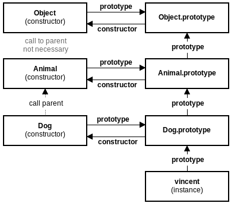

# 📄 JavaScript OOP term

### 1. JavaScript OOP 용어

> 객체지향 프로그래밍은 **추상화\(Abstraction\)**를 사용하여 모델은 만드는 프로그래밍 이다. 모듈성, 다형성 및 캡슐화를 포함한 여러 기술을 사용 한다. 오늘날 많은 인기 있는 프로그래밍 언어는 객체 지향 프로그래밍\(OOP\)을 지원한다.
>
> OOP에서 각 객체는 메서지를 수신하고 데이터를 처리하며 메세지를 다른 객체로 보낼 수 있다. 각 객체는 별개의 역할이나 책임 있는 독립적인 작은 컴퓨터로 볼 수 있다. 객체지향 프로그래밍은 유연성과 유지보수성을 높이기 위한 것이며 대규모 소프트웨어 프로그래밍 에서 널리 사용 된다.
>
> 객체 지향 프로그래밍 특징은 다음 같은 용어로 정리 할 수 있다.

📄 **Class** 

객체 속성\(Properites\)을 정의한다. \(ex : 설계 도면\)

📄 **Object** 

Class의 인스턴스\(Instance\)이다. \(ex : 설계 도면을 통해 구현된 실제 제품\)

📄 **Property** 

객체의 속성을 의미한다. \(ex : color 등과 같은 명사 형태\)

📄 **Method** 

객체의 기능을 의미한다. \(ex : walk\(\)등과 같은 동사 형태\)

📄 **Constructor** 

인스턴스 생성 순간에 호출 실행되는 메서드 이다.

📄 **Inheritance** 

Class는 다른 Class로 부터 속성들을 상속 받을 수 있다. \(Super Class → Sub Class\)

📄 **Encapsulation** 

Class는 해당 객체의 속성, 메서드 만 정의할 수 있다. \(외부 접근 불가\)

📄 **Abstraction** 

복잡한 상속, 메서드, 객체의 속성의 결합은 반드시 현실 모델을 시물레이션 할 수 있어야 한다.

📄 **Polymorphism** 

다른 Class들이 같은 메서드나 속성으로 정의될 수 있다.

### 2. 프로타입 기반 프로그래밍

> 프로토 타입 기반 프로그래밍\(Prototype-based programming\)은 class가 존재하지 않는 객체지향 프로그래밍의 한가지 스타일로, 동작 재사용\(behavior reuse, class 기반 언어에서는 상속\)은 프로토타입으로서 존재하는 객체를 데코레이팅 하는 과정을 통해 수행된다.

