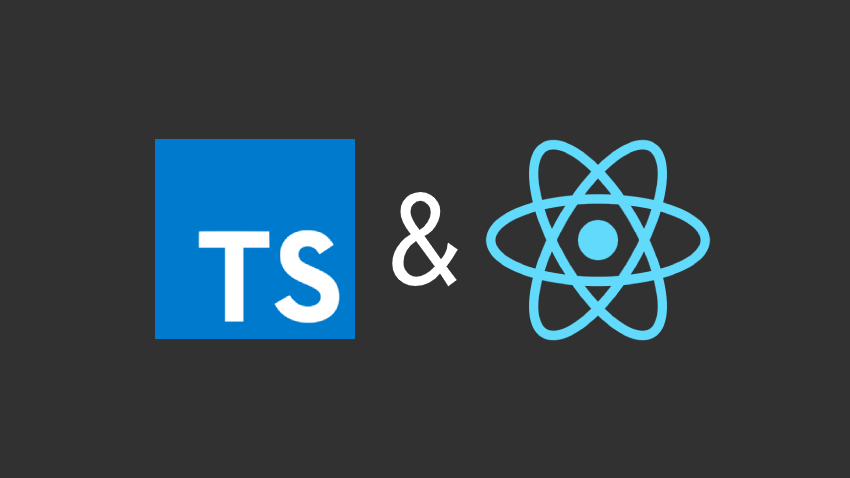

# 📄 TypeScript - Introduction

## 1. TypeScript 

### \(1\). TypeScript를 사용하는 목적

C\# , Java 와 같은 체계적 이고 정제된 언어들에서 사용하는 강한 타입 시스템은 높은 가독성과 코드 품질 등을 제공할 수 있고, 런타임이 아닌 컴파일 환경에서 에러가 발생해 치명적인 오류들을 더욱 더 쉽게 잡아 낼 수 있다. 

반면에 JavaScript는 타입 시스템이 없는 동적 프로그래밍 언어로, JavaScript 변수는 string, number, boolean 등  여러 타입의 값을 가질 수 있다.   

이를 약한 타입의 언어라고 표현할 수 있으며 비교적 유연하게 개발할 수 있는 환경을 제공하는 한편 런타임 환경에서 쉽게 에러가 발생할 수 있는 단점도 가진다.

TypeScript는 이러한 JavaScript를 강한 타입 시스템을 적용해 대부분의 에러를 컴파일 환경에서 코드를 입력하는 동안 체크할 수 있다.

### \(2\). TypeScript의 장점

1. \*\*\*\*[**IDE**](https://www.redhat.com/ko/topics/middleware/what-is-ide)**를 더욱 적극적으로 활용 가능하다.**

   자동완성 및 타입 체킹이 되기 때문에 개발 생산성이 높아진다. 어떤 컴포넌트를 사용하거나 함수를 사용할때 해당 파일을 직접 열어보지 않고도 어떤 props 또는 파라미터를 넣어줘야 하는지 알 수 있다.

2. **개발을 할 때 실수를 줄일 수 있다.**

   함수의 타입을 잘못 설정, 오타, 다른 타입 비교 등등의 오류들을 **TypeScript**를 사용하게 되면 에디터 단에서 바로 알 수 있기 때문에 실수를 줄일 수 있다.

3. **협업을 할 때 유용하다.**

   IDE에서 컴포넌트, 함수 등을 사용할 때 어떤 값을 어떤 타입으로 넣어야 하는지 바로 IDE 상에서 확인 할 수 있기 때문에 굳이 주석으로 작성하거나, 코드를 읽거나 하지 않아도 쉽게 사용할 수 있다.

